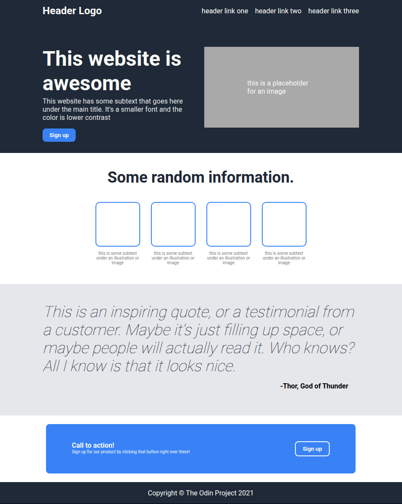

# Landing Page

A landing page built as part of The Odin Project’s
 Foundations curriculum.
This project demonstrates fundamental HTML and CSS layout techniques, including Flexbox, semantic structure, and consistent visual hierarchy.

## Features

Layout designed with Flexbox

Custom color palette and typography

Reusable button and card components

Clean, accessible HTML structure

Organized and well-commented CSS

## Preview

  

## Built With

HTML5 – semantic markup for structure

CSS3 – layout, typography, and design

Flexbox – for alignment and positioning

## Lessons Learned

Structuring a webpage from a design reference

Managing spacing and alignment with Flexbox

Styling interactive elements consistently

Applying hierarchy through font weight and color
